# RM-RDD: A Multi-Class Road Defect Dataset Tailored for Real-World Vehicle Driving Scenarios

At present, publicly available datasets for road defect detection are relatively limited, with most providing only precise location annotations of defects, thereby failing to fully represent the real-world conditions of road surfaces. To address this limitation, some researchers have employed in-vehicle cameras, such as dashcams, for data collection, leading to the creation of publicly available datasets such as RDD2020[1] , RDD2022[2] , and N-RDD2024[3] . However, these datasets still exhibit certain shortcomings: the number of annotated defect categories is limited, the captured environments are often simplified or idealized, and there is a lack of diverse and realistic road scenarios. Moreover, in practical applications, image quality can be significantly degraded by various factors, including windshield reflections, glare from direct sunlight, and occlusions caused by the vehicle hood, which further increases the complexity of road defect detection.

With this objective, we present RM-RDD, a multi-class road defect dataset that is closely aligned with real-world vehicle driving scenarios. During the data collection process, real-time images were captured by engineering vehicles equipped with imaging sensors traveling at normal driving speeds **(as shown in Fig. 1 and Fig. 2)**. The collected images cover a wide range of road types, including highways, provincial roads, and urban streets, ensuring both the diversity and reliability of the dataset. The dataset was collected from various road segments across multiple cities in China, under different temporal conditions such as morning and evening rush hours, daytime, and nighttime. It also incorporates a variety of weather conditions, including sunny, rainy, cloudy, and foggy days, as well as diverse lighting environments such as strong direct sunlight, backlighting, and low-light conditions. These factors significantly enhance the realism and complexity of the road defect detection task. Furthermore, the dataset accounts for variations in vehicle speed, camera mounting height, and installation angle, thereby improving its practical applicability. To ensure data privacy and security, sensitive information such as human faces and license plates has been anonymized using appropriate de-identification techniques.

<table frame=void>
	<tr>
    <td>

</td>
    <td>

</td>
    <td>

</td>
    <td>

</td> 
    </tr>
</table>

​                                                 
Fig. 1. Engineering data acquisition vehicles equipped with cameras.

​ 
	<table frame=void>
		<tr>
	    <td>

</td>
	    <td>

</td> 
	    <td>

</td> 
	    <td>

</td> 
	    </tr>
	</table>

​ 
Fig. 2. The components of the engineering data collection vehicle: in-vehicle camera, GPS module, and AI chip.

In November 2024, we established the **RM-RDD dataset**. The road defect types studied in this paper include eight categories: potholes (D00),  subsidence (D01), longitudinal cracks (D02), longitudinal crack patches (D03), transverse cracks (D04), transverse crack patches (D05), alligator cracks (D06), and alligator crack patches (D07). The dataset comprises a total of **10,440** annotated images, partitioned into a **training set (8,119 images)**, a **validation set (1,000 images)**, and a **test set (1,321 images)**. Representative examples of the different road defect types are shown in **Fig. 3**, and the class distribution is summarized in the following **Table 1**.

<table frame=void>
	<tr>
    <td>
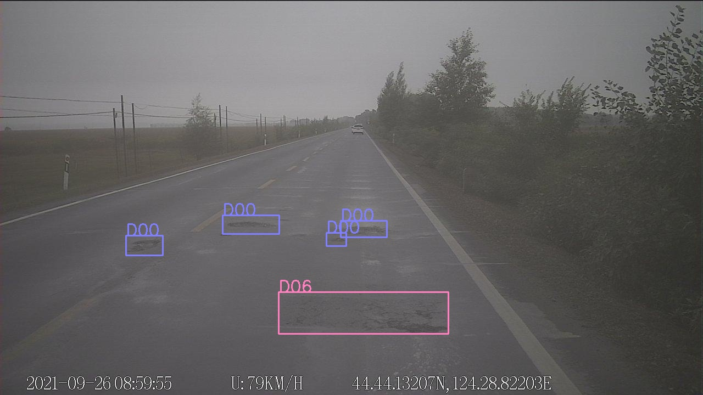
</td>
    <td>
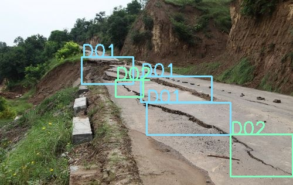
</td>
    <td>
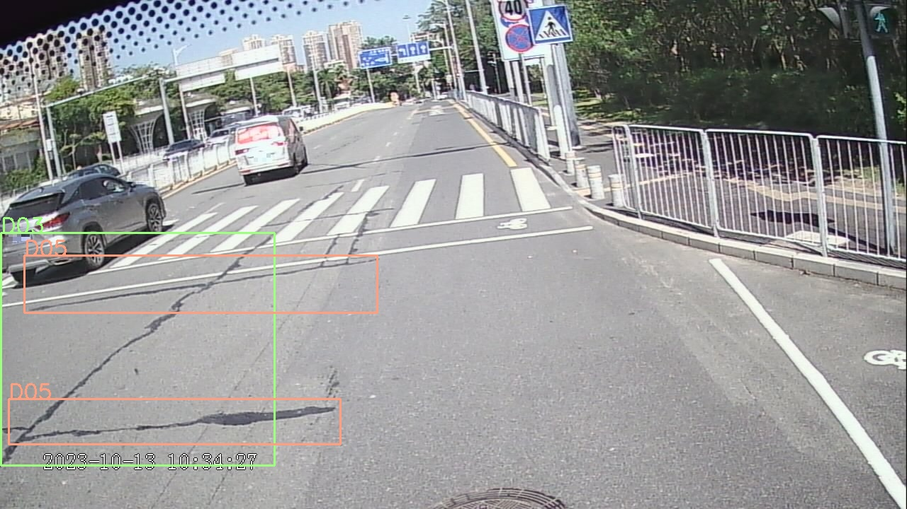
</td>
    </tr>
    <tr>	<!--第二行-->
    <td>
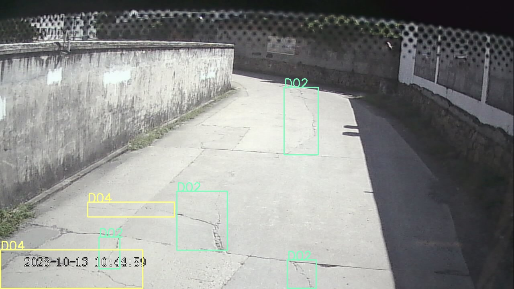
</td> 
    <td>
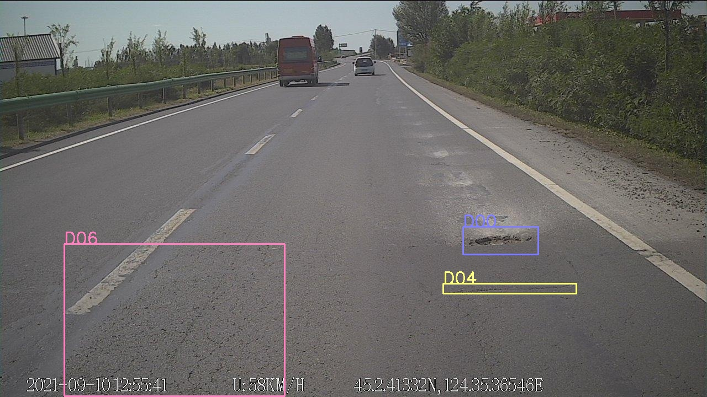
</td> 
    <td>
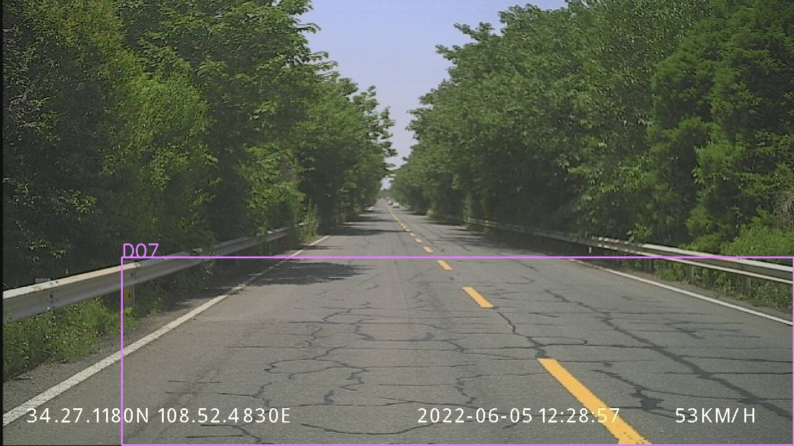
</td> 
    </tr>
</table>

  Fig. 3. Samples from the RM-RDD dataset.

Table 1. Category Distribution of the RM-RDD Dataset
|    Road Damage Types     | Label | Training Set | Validation  Set | Testing Set | Total |
| :----------------------: | :---: | :----------: | :-------------: | :---------: | :---: |
|         Pothole          |  D00  |     1717     |       521       |     199     | 2437  |
|        Subsidence        |  D01  |     1229     |       49        |     282     | 1560  |
|    Longitudinal Crack    |  D02  |     2822     |       418       |     401     | 3641  |
| Longitudinal Crack Patch |  D03  |     4144     |       473       |     843     | 5460  |
|     Transverse Crack     |  D04  |     2478     |       315       |     328     | 3121  |
|  Transverse Crack Patch  |  D05  |     4893     |       514       |    1005     | 6412  |
|     Alligator Crack      |  D06  |     1177     |       175       |     129     | 1481  |
|  Alligator Crack Patch   |  D07  |     1058     |        75       |     171     | 1304  |

In January 2025, we further improved the RM-RDD dataset by anonymizing its metadata, including GPS coordinates, vehicle speed, capture timestamps, and vehicle identifiers. In addition, we enriched the validation set by adding 500 newly annotated samples, aiming to enhance model robustness during training and improve generalization for real-world deployment. Based on these enhancements, we introduce the **RDD2025 dataset**, which comprises a total of **10,940** annotated images. These images are partitioned into a **training set (8,119 images)**, a **validation set (1,500 images)**, and a **test set (1,321 images)**. Representative examples of the various road defect types are shown in **Fig. 4**, and the detailed class distribution is summarized in the following **Table 2**.

<table frame=void>
	<tr>
    <td>
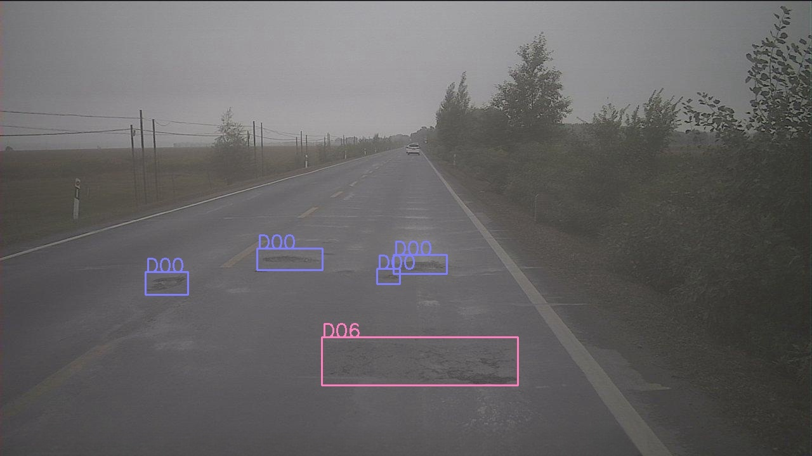
</td>
    <td>
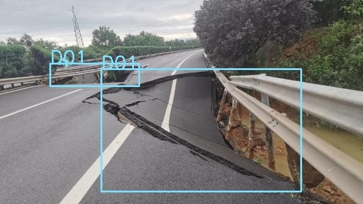
</td>
    <td>
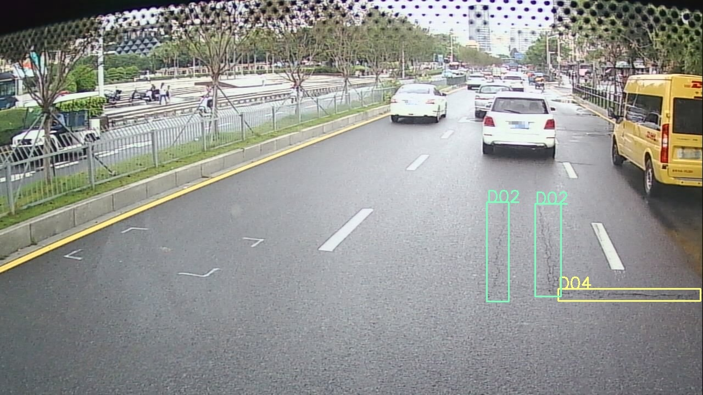
</td>
    </tr>
    <tr>	<!--第二行-->
    <td>
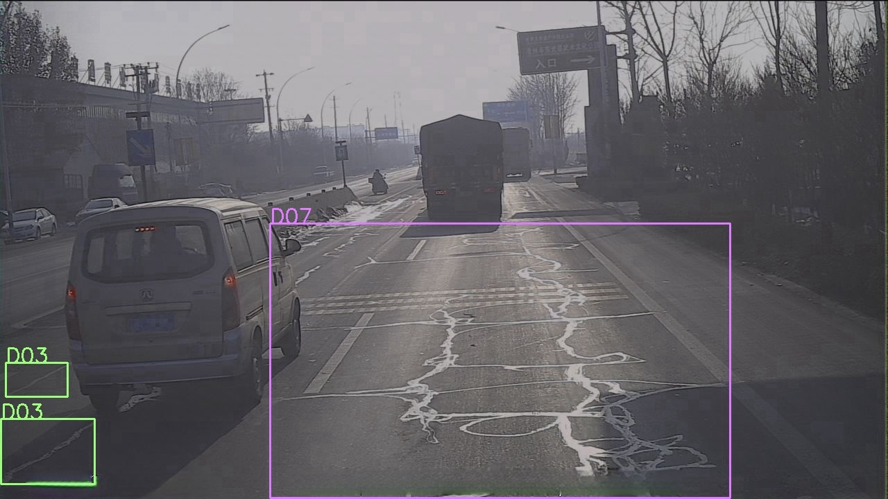
</td> 
    <td>
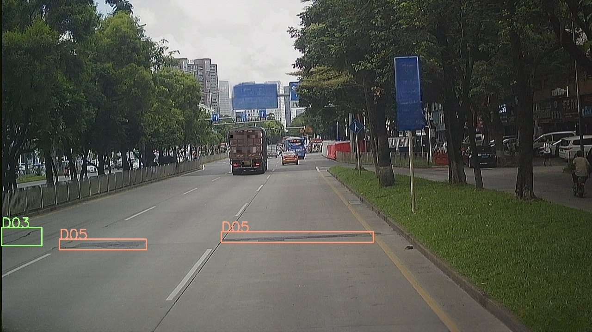
</td> 
    <td>
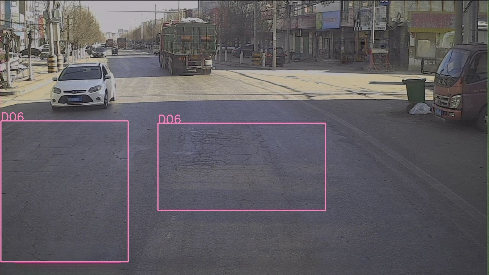
</td> 
    </tr>
</table>

  Fig. 4. Samples from the RM-RDD2025 dataset.   

Table 2. Category Distribution of the RM-RDD2025 Dataset
|    Road Damage Types     | Label | Training Set | Validation  Set | Testing Set | Total |
| :----------------------: | :---: | :----------: | :-------------: | :---------: | :---: |
|         Pothole          |  D00  |     1717     |       777       |     199     | 2693  |
|        Subsidence        |  D01  |     1229     |       74        |     282     | 1585  |
|    Longitudinal Crack    |  D02  |     2822     |       644       |     401     | 3867  |
| Longitudinal Crack Patch |  D03  |     4144     |       723       |     843     | 5710  |
|     Transverse Crack     |  D04  |     2478     |       446       |     328     | 3252  |
|  Transverse Crack Patch  |  D05  |     4893     |       841       |    1005     | 6739  |
|     Alligator Crack      |  D06  |     1177     |       247       |     129     | 1553  |
|  Alligator Crack Patch   |  D07  |     1058     |       101       |     171     | 1330  |

​																

## 🚀 Updates
- \[2025.01\] Performed key information anonymization on the RM-RDD dataset and created the RM-RDD2025 dataset.
- \[2024.11\] Created the RM-RDD dataset.

## 🦄 References
[1] Arya D, Maeda H, Ghosh S K, et al. RDD2020: An annotated image dataset for automatic road damage detection using deep learning[J]. Data in brief, 2021, 36: 107133.

[2] Arya D, Maeda H, Ghosh S K, et al. RDD2022: A multi‐national image dataset for automatic road damage detection[J]. Geoscience Data Journal, 2024, 11(4): 846-862.

[3] KAYA Ö, Çodur M Y. Annotated Dataset for Detecting Road Damage and Defects: N-Rdd2024[J]. Available at SSRN 4699394.

